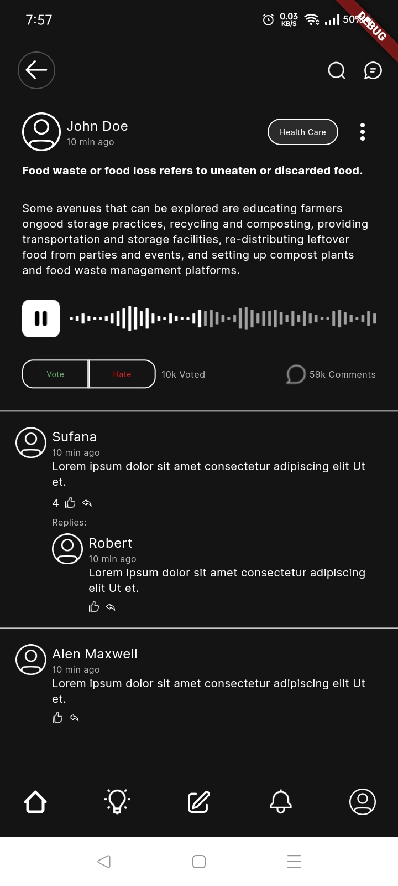

# Maverin Assignment

A new Flutter project.

## Screen Shots

## Installation

Clone the project on your computer. Open a terminal, navigate to the lib folder of the project and run `flutter run -v`
